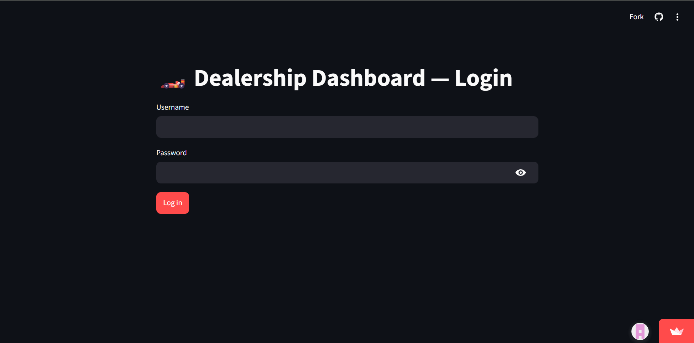
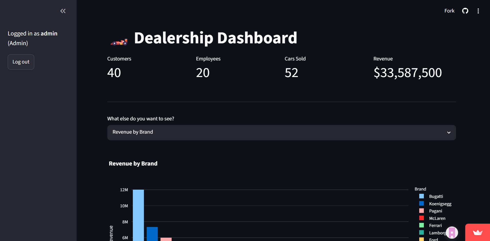
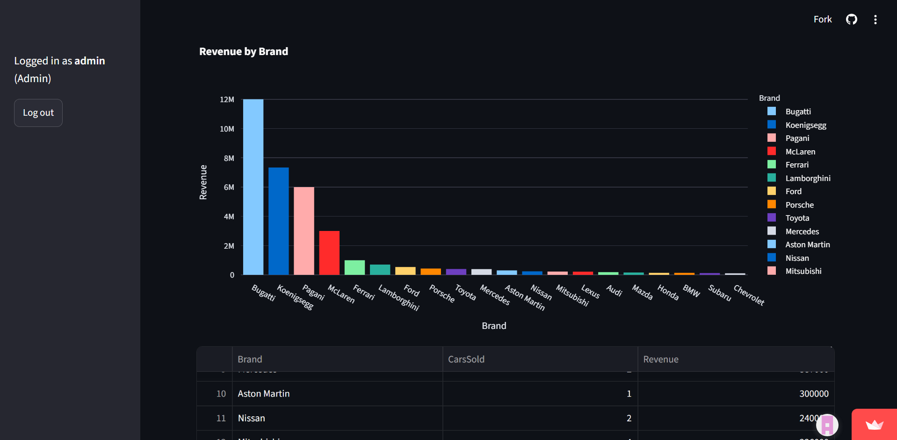

# 🚗 DealerLens — Dealership Management Dashboard

A single-page Streamlit dashboard built on top of a relational MySQL database for a car dealership. It surfaces KPIs, sales trends, inventory status, and employee performance from live SQL queries — no spreadsheets, no manual exports — behind a role-based login.

---

## Features

- **Authentication & roles** — bcrypt-hashed passwords, session-based login gate, and role-aware permissions (`Admin`, `Owner`, `Manager`, `Sales` can edit; other roles are read-only)
- **KPIs at a glance** — total customers, employees, cars sold, and revenue
- **Revenue by brand** — Plotly bar chart of delivered sales by car brand
- **Employee sales performance** — bar chart of cars sold per employee
- **Order status breakdown** — pie chart of Pending / Confirmed / Delivered orders
- **Customer purchase report** — full order history joined with customer and car details
- **Current inventory** — stock levels per vehicle, with brand filtering
- **Unsold vehicles** — cars that have never been ordered
- **Low stock alert** — vehicles at or below a stock threshold
- **Update order status** — staff-only write action, gated by role

All views run directly off live queries against MySQL — no data duplication, no caching layer.

---

## Screenshots

> Add your own screenshots here after deploying. Suggested shots: the login page, the KPI row, Revenue by Brand chart, and one data table view.






---

## Entity-Relationship Diagram (ERD)

> Export your ERD (from MySQL Workbench, dbdiagram.io, or similar) as a PNG and drop it in `docs/erd.png`, then this will render automatically.


**Core entities:**
- `Buyer` — customers, with `BuyerPhone` for multivalued phone numbers
- `Employee` — staff, with self-referencing `Manager_ID`, linked to `Job` and `Company`
- `Car` — vehicle catalog, with `CarColor` and `Modification` as dependent multivalued/weak entities
- `CarOrder` — the sales transaction linking `Buyer`, `Employee`, and `Car`
- `Company` — dealership branches, each linked to a `Workshop`
- `Workshop` / `Sparepart` — service centers and their parts inventory
- `CarProvision` — vehicles supplied to a `Company` from a manufacturer
- `UserAccount` / `UserSession` — authentication layer, now wired into the app UI

---

## Relational Schema

> Paste your relational schema diagram (tables + PK/FK arrows) at `docs/relational-schema.png`, or keep the text version below as a lightweight fallback.


<details>
<summary>Text version (click to expand)</summary>

```
Buyer(Customer_ID PK, FirstName, LastName, BirthDate, Address, ZipCode, City, State, Occupation)
BuyerPhone(Customer_ID FK, PhoneNumber, PK(Customer_ID, PhoneNumber))
Job(Job_ID PK, JobDesc, Salary)
Workshop(Workshop_ID PK, Service, ServicePrice)
Sparepart(Sparepart_ID PK, Price, BrandSP, DescSP, StockQuantity, Workshop_ID FK)
Car(SerialNumber PK, Brand, CarName, Model, ManufacturingYear, SalePrice, StockQuantity)
CarColor(SerialNumber FK, CarColor, PK(SerialNumber, CarColor))
Modification(SerialNumber FK, ModificationType, ModificationPrice, ModificationDesc, PK(SerialNumber, ModificationDesc))
Company(Company_ID PK, CompanyName, City, State, Address, ZipCode, PhoneNumber, Email, Headquarters_ID FK, Workshop_ID FK)
CarProvision(Provision_ID PK, Company_ID FK, SerialNumber FK, ProcessDate, TotalPrice)
Employee(Employee_ID PK, FirstName, LastName, Email, City, State, ZipCode, Address, Job_ID FK, Manager_ID FK, Company_ID FK)
CarOrder(Order_ID PK, Customer_ID FK, Employee_ID FK, SerialNumber FK, OrderDate, OrderStatus, DownPayment, CreatedAt)
EmployeePhone(Employee_ID FK, PhoneNumber, PK(Employee_ID, PhoneNumber))
EmployeeFamily(Employee_ID FK, Name, InsuranceType, BirthDate, Gender, PK(Employee_ID, Name))
UserAccount(Account_ID PK, Username, Email, PasswordHash, Role, IsActive, CreatedAt, LastLogin, Employee_ID FK, Customer_ID FK)
UserSession(Session_ID PK, Account_ID FK, IPAddress, UserAgent, CreatedAt, ExpiresAt)
```
</details>

---

## Authentication & Roles

DealerLens gates the whole dashboard behind a login screen backed by the `UserAccount` table:

- Passwords are hashed with **bcrypt** — plaintext passwords are never stored or transmitted to the DB.
- On login, the entered password is checked against `PasswordHash` with `bcrypt.checkpw()`.
- `IsActive` accounts only — deactivated accounts can't log in even with the correct password.
- A user's `Role` is loaded into `st.session_state` and drives what they can do:
  - **Admin / Owner / Manager / Sales** → full read access + can update order status
  - All other roles → full read access, write actions are hidden/blocked
- Logging out clears the session state and returns to a centered login page; a successful login switches the layout to wide for the full dashboard.

Hashes are generated with `generate_hashes.py` and applied to the database with plain `UPDATE` statements (see [Setup](#setup) below) — nothing here depends on Aiven having a built-in query console; any MySQL client works.

---

## Project Structure

```
dealerlens/
├── app.py                  # Entire Streamlit app (single file)
├── generate_hashes.py      # One-off script to bcrypt-hash plaintext passwords
├── requirements.txt        # Python dependencies
├── database.sql            # MySQL schema + seed data (source of truth for the DB)
├── queries.sql              # Standalone reference queries the app is built from
├── .gitignore               # Excludes .streamlit/secrets.toml from version control
├── .streamlit/
│   └── secrets.toml          # Local-only DB credentials (never committed)
├── docs/
│   ├── erd.png                # Entity-relationship diagram
│   └── relational-schema.png  # Relational schema diagram
└── screenshots/
    ├── login.png
    ├── dashboard-overview.png
    ├── revenue-by-brand.png
    └── inventory.png
```

---

## Tech Stack

- **Database:** MySQL (hosted on [Aiven](https://aiven.io), free tier)
- **App/UI:** [Streamlit](https://streamlit.io)
- **Auth:** [bcrypt](https://pypi.org/project/bcrypt/) password hashing, session-based login
- **Charts:** [Plotly](https://plotly.com/python/)
- **Data handling:** pandas
- **Hosting:** [Streamlit Community Cloud](https://share.streamlit.io)

---

## Setup

### 1. Clone the repo
```bash
git clone https://github.com/YOUR_USERNAME/dealerlens.git
cd dealerlens
```

### 2. Install dependencies
```bash
pip install -r requirements.txt
```

### 3. Set up the database
Create a free MySQL instance (e.g. on Aiven), then load the schema and data:
```bash
mysql --host=<HOST> --port=<PORT> --user=<USER> --password --ssl-mode=REQUIRED < database.sql
```

### 4. Generate real password hashes
The seed data ships with placeholder hashes. Edit `generate_hashes.py` with the plaintext passwords you want for each account, run it, then apply the output as `UPDATE` statements:
```bash
python generate_hashes.py > update_passwords.sql
mysql --host=<HOST> --port=<PORT> --user=<USER> --password --ssl-mode=REQUIRED Dealership < update_passwords.sql
```

### 5. Configure credentials
Create `.streamlit/secrets.toml` (this file is gitignored — never commit it):
```toml
host = "your-mysql-host"
port = 12345
user = "avnadmin"
password = "your-password"
database = "Dealership"
```

### 6. Run locally
```bash
streamlit run app.py
```

---

## Deployment

Deployed on **Streamlit Community Cloud**, connected to a MySQL instance on **Aiven**. Secrets are set via the app's **Advanced settings → Secrets** box on Streamlit Cloud, mirroring local `secrets.toml`.

Live app: `https://your-app-name.streamlit.app` *(update once deployed)*

---

## Notes / Limitations

- This is a client application over MySQL, not a DBMS itself — MySQL handles storage, constraints, and stock-management triggers; this app is the read/write interface on top.
- Session state is per-browser-tab and in-memory only; there's no persistent "remember me" or JWT-based session token yet — closing the tab logs you out.
- `UserSession` table exists in the schema for tracking login history/IP/user-agent, but isn't populated by the app yet — a natural next step for audit logging.
- No password reset or self-service account creation flow yet; accounts are provisioned directly in the database.
